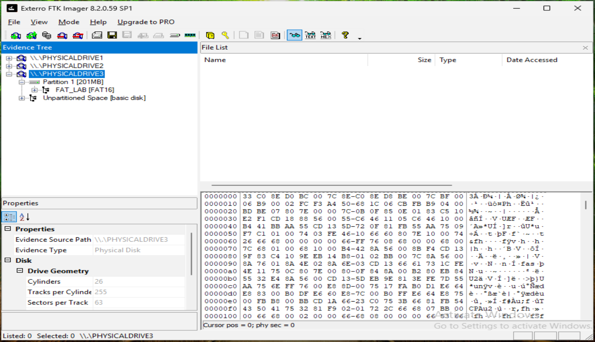
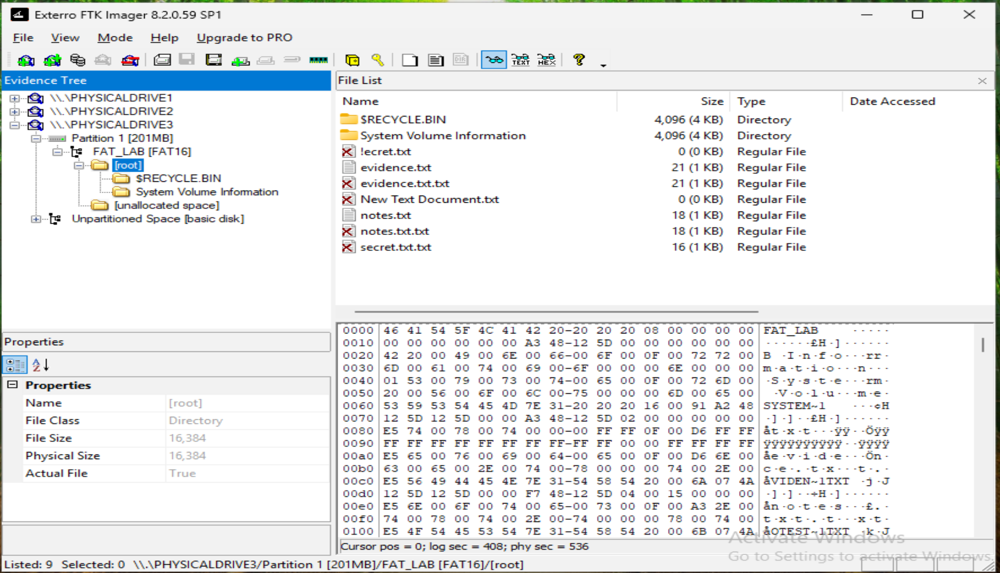
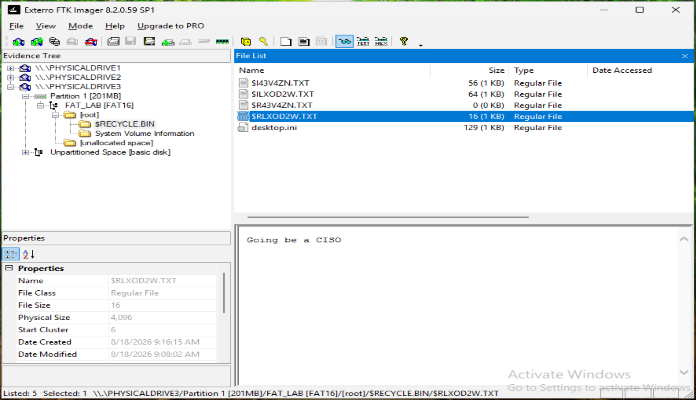
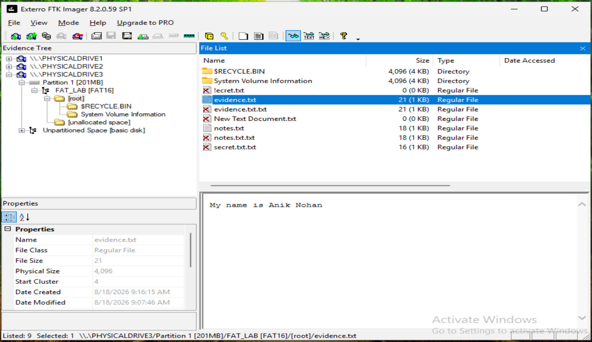
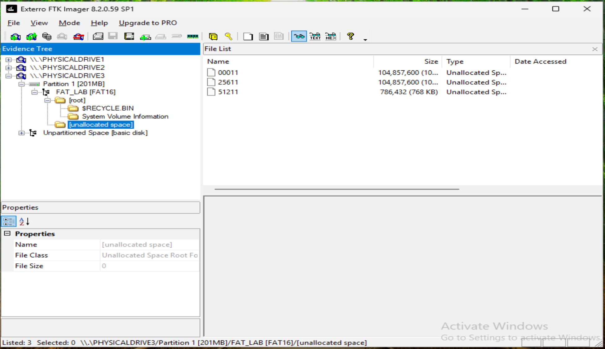

---

## FAT16 File-System Examination

FTK Imager identified the volume as `FAT_LAB [FAT16]`. The file system contained the root directory, FAT metadata, reserved sectors, and unallocated space.

---

## Root Directory Examination

The FAT16 root directory contained active files as well as deleted-file entries. Deleted entries were identified by the red X indicators displayed by FTK Imager.

---

## Deleted File Recovery

Deleted file artifacts remained accessible through the FAT16 file system and the Recycle Bin. FTK Imager allowed the contents of a deleted text file to be examined.

---

## Active File Content

An active file named `evidence.txt` was examined. FTK Imager displayed the file content and associated metadata, demonstrating examination of an allocated file.

---

## Unallocated Space

FTK Imager identified multiple regions of unallocated space within the FAT16 volume. These areas may contain residual data from previously deleted files.

---

## Key Findings

The FAT16 examination demonstrated:

- Identification of the FAT16 file-system structure.
- Examination of active and deleted files.
- Recovery and inspection of deleted-file content.
- Review of file metadata and contents.
- Identification of unallocated disk space.

These findings demonstrate how FTK Imager can be used to examine FAT16 file-system artifacts and recover evidence from deleted files.
